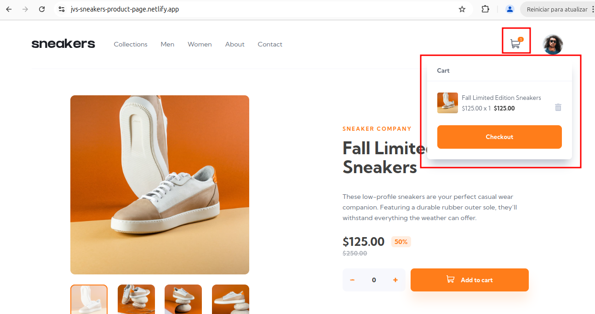
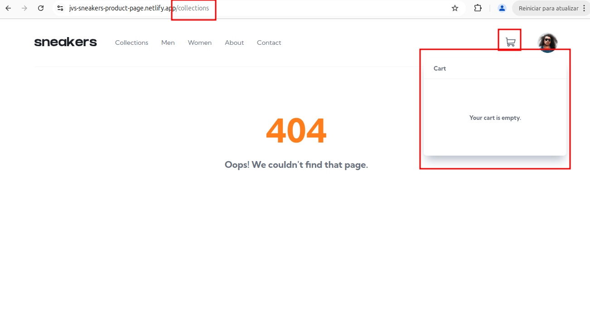

## [SNKRS-1] Item removido do carrinho de compras ao navegar entre as páginas da aplicação.

**Descrição.**

Após adicionar um item ao carrinho de compras, a navegação entre as páginas 'Sneakers', 'Collection', 'Men', 'Women', 'About' ou 'Contact' remove o item do carrinho.

**Passos para reproduzir.**
    
1. Acesse [Sneakers](https://jvs-sneakers-product-page.netlify.app/);

2. Selecione pelo menos 1 unidade do produto e clique em “Add to cart”;

3. Verifique o item no carrinho de compras;

4. Clique em uma das opções de navegação ('Sneakers', 'Collection', 'Men', 'Women', 'About' ou 'Contact').

5. Acesse novamente o carrinho de compras.

**Resultado esperado:** o item permanece no carrinho de compras.

**Resultado real:** o item é removido do carrinho de compras.

---

**Severidade**: crítica(pode gerar desistência na compra).

**Prioridade**: alta (o bug afeta a compra de produtos).

## Ambiente.
Navegadores: 

- Chrome versão 129;
- Opera versão 117;
- Firefox versão 136.

Aplicação: [Sneakers](https://jvs-sneakers-product-page.netlify.app/) 

## Evidências.

