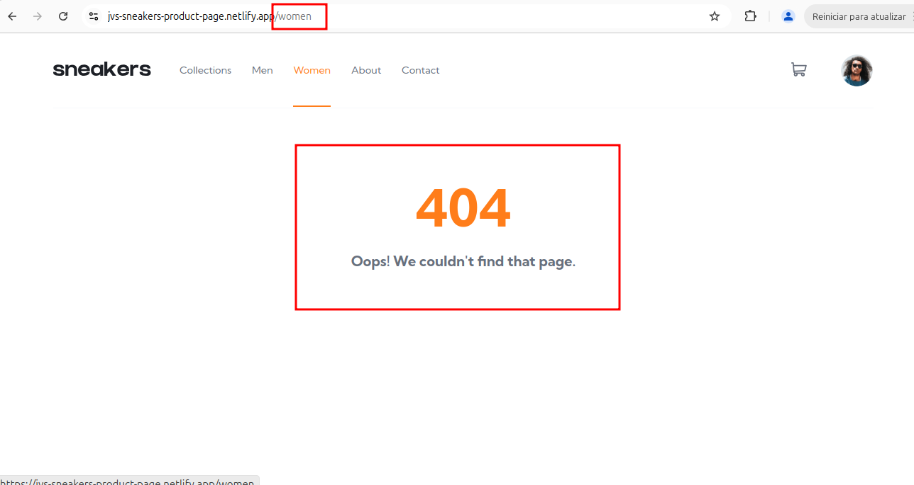

## [SNKRS-5] Conteúdo da página "Women" não carrega e exibe "Not Found".

**Descrição.**

Ao acessar a página "Women" através do menu de navegação, a página carrega uma mensagem de erro. O esperado era que o conteúdo da página fosse carregado corretamente.

**Passos para reproduzir.**
    
1. Acesse [Sneakers](https://jvs-sneakers-product-page.netlify.app/);

2. Clique em “Women” no menu de navegação;

**Resultado esperado:** o conteúdo da página “/women” carrega corretamente.

**Resultado real:** o conteúdo da página “/women” não carrega e exibe mensagem “404 Oops! We couldn't find that page.”

---

**Severidade**: crítica (impede carregamento de página de apresentação de produto).

**Prioridade**: alta (o bug afeta o fluxo de compra de produtos).

## Ambiente.
Navegadores: 

- Chrome versão 129;
- Opera versão 117;
- Firefox versão 136.

Aplicação: [Sneakers](https://jvs-sneakers-product-page.netlify.app/) 

## Evidências.

