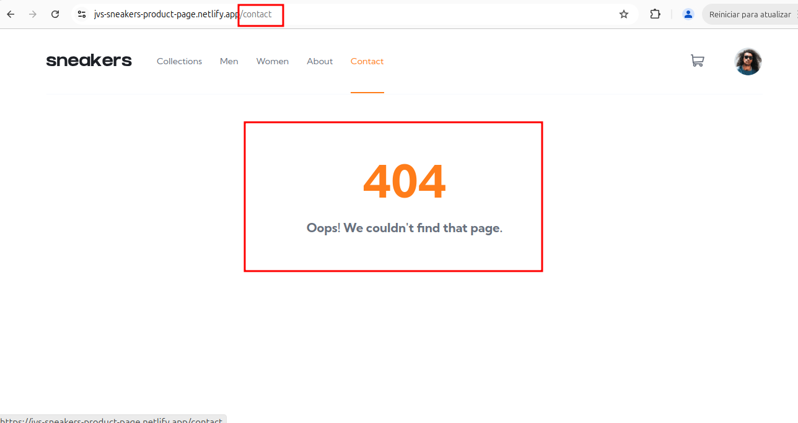

## [SNKRS-7] Conteúdo da página "Contact" não carrega e exibe "Not Found".

**Descrição.**

Ao acessar a página "Contact" através do menu de navegação, a página carrega uma mensagem de erro. O esperado era que o conteúdo da página fosse carregado corretamente.

**Passos para reproduzir.**
    
1. Acesse [Sneakers](https://jvs-sneakers-product-page.netlify.app/);

2. Clique em Contact no menu de navegação;

**Resultado esperado:** o conteúdo da página “/contact carrega corretamente.

**Resultado real:** o conteúdo da página “/contact não carrega e exibe mensagem “404 Oops! We couldn't find that page.”.

---

**Severidade**: média (impede carregamento de página, mas não afeta a compra de produto).

**Prioridade**: baixa (não impede a compra de produtos).

## Ambiente.
Navegadores: 

- Chrome versão 129;
- Opera versão 117;
- Firefox versão 136.

Aplicação: [Sneakers](https://jvs-sneakers-product-page.netlify.app/) 

## Evidências.

