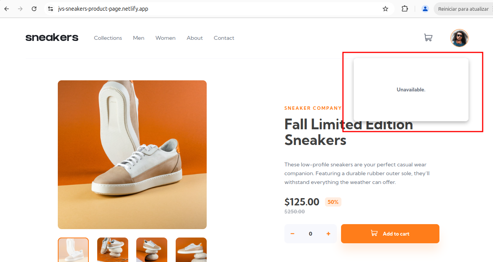

## [SNKRS-8] Modal de perfil de usuário não apresenta as opções de navegação.

**Descrição.**

Após estar logado na aplicação, clicar na miniatura de imagem de perfil do usuário abre um modal com a mensagem “Unavailable.”. O esperado abrir um modal com as opções de navegação “Ver informações de perfil” e “Sair”.

**Pré-condição.**
1. Estar logado na aplicação.

**Passos para reproduzir.**
    
1. Acesse [Sneakers](https://jvs-sneakers-product-page.netlify.app/);

2. Clique na imagem de perfil do usuário no canto superior direito;

**Resultado esperado:** um modal abre com as opções: “Ver informações de perfil” e “Sair”.

**Resultado real:** um modal abre com a mensagem “Unavailable.”.

---

**Severidade**: alta (não impede a compra de produto, mas impede usuário de editar dados pessoais e realizar logout).

**Prioridade**: média (afeta a experiência do usuário, mas não impede a compra de produtos).

## Ambiente.
Navegadores: 

- Chrome versão 129;
- Opera versão 117;
- Firefox versão 136.

Aplicação: [Sneakers](https://jvs-sneakers-product-page.netlify.app/) 

## Evidências.

